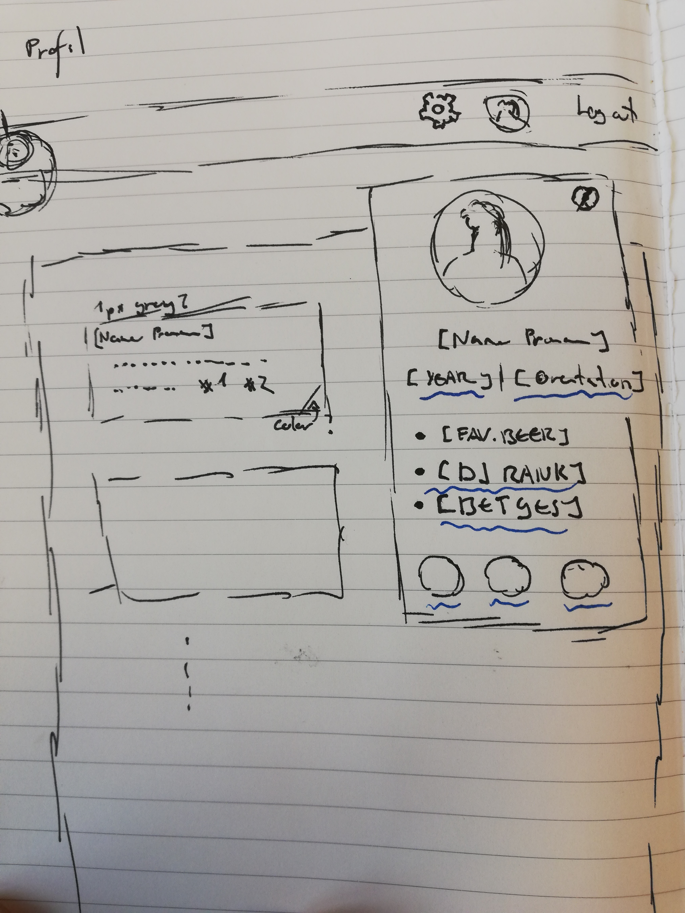
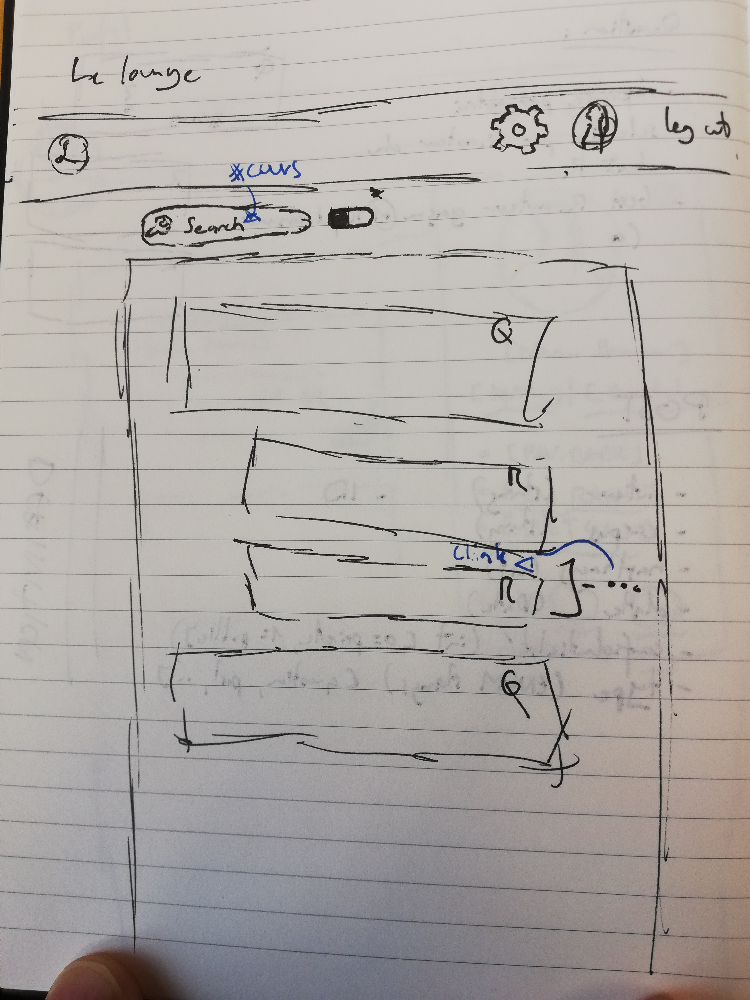
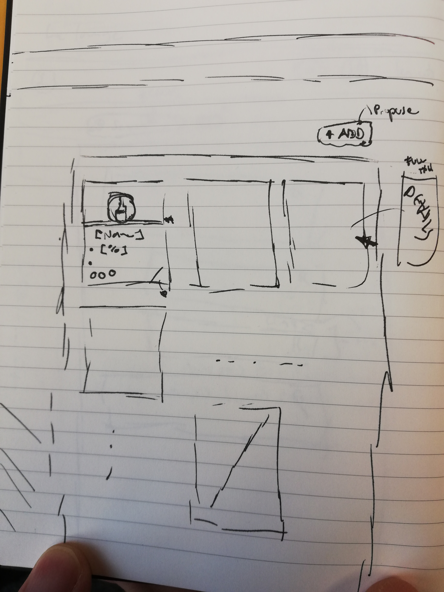

###TWEB / MAC

## Codename

## 	 Lounge Yghrẽk.

---

#### Contributors

	Quentin Gigon (MAC/TWEB)
	Yohann Meyer (TWEB)
	Benjamin Thomas (MAC/TWEB)
	Olivier Djeulezeck (MAC)

## Issue

After years and years of improvements in our so orange school, we happend to still lack efficients way of meeting, coaching and interacting with others students; the basis of a successful and fulfilling life and the production of good little workers. 

The ChillOut is an attempt at solving this problem through the access to a beer-filled, couch-packed place with many opportunities to have fun and/or work with others. But the reality is harsh and unforgiving, for the beer is not always readily accessible and the others sometimes busy when we're not -be it for a classe or for any outdoor activity, like gardening. 

## Proposition

Given the ease with which social network have ~~infested~~ made themselves fundamental in our lives, we think we can apply the general ideas they contains to create a **private** network of students and member of the professoral college. 
People will be able to create an account with their heig-vd.ch  email account and enjoy many way of interacting with others. 

The main point are as follow: 

+ Personal Wall and Profile
+ Posts / Questions - Comments / Responses
+ Beer showroom  (*optional*)

## Features

### Personal Wall and Profile

A page containing different infos about the user and their feed. 

+ different confidentiality settings
+ possibilty of (un)friending someone
+ possibility to be anonymous (to other, but not to us overpowered developers)
+ can post either **text** or **gifs** (and stickers if easily implementable.)
+ Classical features of social network: e.g. subscribe, ...

### Posts / Questions - Comments / Responses

On a page called the Lounge, we have every public post made available to every user of the network. 
You can either **post** something to shoot the shit with others who can then **comment** on your post, or you can post a **question** with (eventually) some **hashtags** referring to a specific course /set of courses, and people can then **respond** to your question. 

#### Posts

+ classics attributes such as author name, date, corpus, ...
+ can be CRD, but not U
+ different confidentiality settings
+ can be easily browsed on the profile (specific) or in the Lounge, search also possible in that case (all)

#### Questions

+ are defined by the existence of a **question mark** in the corpus
+ different confidentiality settings
+ can be easily browsed on the profile (specific) or in the Lounge, search also possible in that case(all)

#### Comments

+ Are linked to a specific post
+ same privacy settings
+ one-level indentation only

#### Responses

- Are linked to a specific post
- same privacy settings
- one-level indentation only
- Can be selected as **top answer** by the question author
  - give the answer authors some bonuses

---

## Optional features

 ### Beer Showroom

A place to see which beer are available currently @ChillOut were available or will be available, based on the API of `brewerydb.com`. It's the first step in connecting the people and the beer, a great adventure. 

- People can add/vote on beer they want to drink

- People can learn about beers there

## Documents representation

User:

* **ID**: ObjectId
* **username**: String
* **firstName**: String
* **lastName**: String
* **email**: String
* **password**: String
* **isAdmin**: Boolean
* **ownFeedPosts**: List[ObjectId Post]
* **friendsList**: List[ObjectId User]

Post:

* **ID**: ObjectId
* **text**: String
* **date**: TimeStamp
* **author**: ObjectId
* **type**: enum(POST, QUESTION, COMMENT, RESPONSE)
* **isCorrectAnswer**: Boolean
* **responseList**: List[ObjectId Post]
* **hashtagsList**: List[ObjectId Hashtag]

Hashtag:

* **ID**: ObjectId
* **name**: String
* **postsContainingThisHashtag**: List[ObjectId Post]

## Technologies

* **Backend**: Express.
* **Frontend**: React.
* **REST API** for communication between the two.
* **MangoDB** as NOSQL database.

